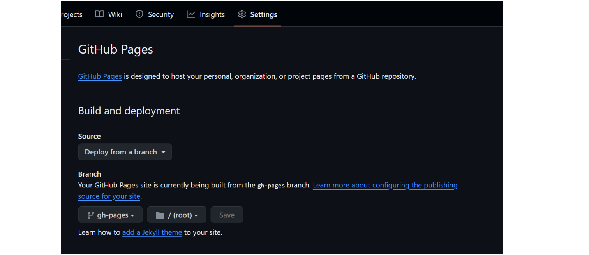

# MkDocs搭建此站 
[主要参考](https://squidfunk.github.io/mkdocs-material/creating-your-site/)中详细讲述了MkDocs搭建本站的各种配置，如果想**从头到尾**完全的完善自己的网站，十分推荐认真阅读，当然也可以把这个教程当做字典来检索需要的功能。

一些其他的参考

- [mkdoc官方教程](https://www.mkdocs.org/user-guide/) 

- [咸鱼暄](https://xuan-insr.github.io/%E6%9D%82%E9%A1%B9/%E5%8D%9A%E5%AE%A2%E6%90%AD%E5%BB%BA%E8%AE%B0%E5%BD%95/#%E5%85%A5%E9%97%A8%E6%95%99%E7%A8%8B)

- [ZLDF](https://zhengliangduanfang.github.io/hmpg_mkdocs/)

- [98一位大佬](https://7kevin24.github.io/Tech-guide/Mkdocs%20and%20Material%20theme/)

在配置时出现了一些奇怪的问题

## Github Actions的使用
这里使用了**Github Actions**  在文件根目录添加
> .github/workflows/ci.yml

```yaml title="the content of ci.yml" linenums="1"
name: ci 
on:
  push:
    branches:
      - master 
      - main
permissions:
  contents: write
jobs:
  deploy:
    runs-on: ubuntu-latest
    steps:
      - uses: actions/checkout@v4
      - name: Configure Git Credentials
        run: |
          git config user.name github-actions[bot]
          git config user.email 41898282+github-actions[bot]@users.noreply.github.com
      - uses: actions/setup-python@v5
        with:
          python-version: 3.x
      - run: echo "cache_id=$(date --utc '+%V')" >> $GITHUB_ENV 
      - uses: actions/cache@v4
        with:
          key: mkdocs-material-${{ env.cache_id }}
          path: .cache
          restore-keys: |
            mkdocs-material-
      - run: pip install mkdocs-material 
      - run: mkdocs gh-deploy --force
```

这段代码 同时在项目仓库的设置中设置



这样每次在master分支下更新内容，就会自动更新部署的界面

但是请注意，这样的**github action**是没有插件的，我的理解是github action实际上为我们简化了mkdocs build的操作
，因此本地安装的mkdocs的插件在github action上实际上无法使用，需要pip install我们的插件
```yaml title="需要向ci.yml中添加的内容"
  # 安装所需要的插件 
  - run: pip install mkdocs-glightbox
```

## CSS文件理解
**CSS** 指层叠样式表 (Cascading Style Sheets)，就是对于HTML语言的渲染，这里有一个[CSS渲染HTML实例](https://www.runoob.com/try/demo_source/demo_default.htm)

## CSS的颜色配置
[颜色标准](https://www.color-hex.com/)可以参考，对比更加明显

## 图片的插入
使用[lightbox插件](https://squidfunk.github.io/mkdocs-material/reference/images/#lightbox)使用HTML语言+Markdown是可以实现调整图片
大小的功能的
```html
<figure markdown="span">
  { width="300" }
  <figcaption>Image caption</figcaption>
</figure>
```
缺点就是太过于繁琐，因此能使用文本就不要使用图片

## content.code.select失效
问题尚未解决，不知道问题在哪里

