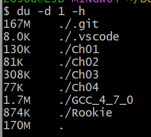

# Learn git
Git is a distributed version control system.
Git is a free software distributed under the GPL.
Git has a mutable index called stage.
Git tracks changes of files.

Creating a new branch is quick and simple.
Edit something.

Let's try the 'tag' (LJDHandSome)


## My method to learning git
First, I learn the book <<Git简要教程-廖雪峰>>. And you can find it in resource.
And I find the [git-cheat-sheet](https://education.github.com/git-cheat-sheet-education.pdf) to help me to
remember some instructions.

And I summarized what I learned.

> git add 'file'

添加文件到缓冲区
> git commit -m " XXX "

提交文件 -m的意思是message
> git status

查看当前状态
> git diff

查看现在的文件和上一次commit的文件的区别

> git log

查看提交历史
> git log --pretty=oneline --abbrev-commit

每一条历史占据一行 并且缩写commit id
> git reset --hard "commit id"

版本回退 其中的commit id可以写成"HEAD ^^^"或者"HEAD~100" 表示回退到前100个版本
> git reflog 

回退后查看未来的提交

> git checkout -- file

撤销工作区的修改

如果已经把需要修改的内容提交到了暂存区 首先**git reset HEAD "file"**来清除暂存区
然后使用**git checkout -- file**来丢弃工作区的修改

> git remote add origin git@github.com:XXX

添加远程仓库“origin” 

> git push -u origin master

这里的-u是制定上游(upstream)为origin  向origin仓库提交我们的master分支

> git checkout -b dev

创建并且切换到dev分支 相当于
> git branch dev


> git checkout dev


> git merge dev

直接合并dev分支

> git branch -d dev

删除dev分支

当合并分支发生冲突的时候 去文件里查看具体冲突的细节 然后add commit

> git merge --no-ff -m "merge with no-ff" dev

不采用"Fast forward"的方式合并分支 这样合并分支后 可以知道分支合并的信息
> git log --graph --pretty=oneline --abbrev-commit

以graph的形式查看分支合并情况

> git remote

查看远程仓库信息
> git remote -v

查看远程仓库更加详细的信息
> git push origin XXX

将XXX分支推送到origin中

> git checkout -b dev origin/dev

创建本地的dev分支 并且关联origin的dev

> git branch --set-upstream branch-name  origin/branch-name

建⽴本地分⽀和远程分⽀的关联，使⽤

多⼈协作的⼯作模式通常是这样：
1. ⾸先，可以试图⽤git push origin branch-name推送⾃⼰的修改；
2. 如果推送失败，则因为远程分⽀⽐你的本地更新，需要先⽤git pull试图合并；
3. 如果合并有冲突，则解决冲突，并在本地提交；
4. 没有冲突或者解决掉冲突后，再⽤git push origin branch-name推送就能成功！

> git config --global alias.st status

git的自定义操作 st是stats的别名 git st ==== git status 更加简单

分享一下我的git配置
> git config --global alias.lg "log --color --graph --pretty=format:'%Cred%h%Creset -%C(yellow)%d%Creset %s %Cgreen(%cr) %C(bold blue)<%an>%Creset' --abbrev-commit"


> git config --global alias.st status


> git config --global alias.co checkout


> git config --global alias.br branch


> git config --global alias.cm 'commit -m'


> git config --global alias.unstage 'reset HEAD'


> git config --global alias.last 'log -1'


## 日常使用发现的一些问题

> git branch -M main

github希望我们用这样的指令 把当前的分支改名为main(master改名为main)
由于我异性修改了快捷键 只需要**git br -M main**


[显示隐藏的git目录](https://blog.csdn.net/baicha11/article/details/127700351)

本来提交了一个100MB以上的大文件打算git push 结果不能 而后删除这个大文件 结果还是不能push 原因是删除后.git文件还是很大因此需要



具体的[教程](https://juejin.cn/post/6844903448627019789) 还有一种[方法](https://www.jianshu.com/p/780161d32c8e)
[解决.git文件过大的问题](https://blog.csdn.net/HOU_Zhe/article/details/115265834)
我是菜鸡  为了解决这个问题，我使用了
> rm -rf .git

直接把git全删了 然后git init  git add .  git cm

这个故事告诉我们 有大文件的时候 不要git add . 呜呜呜

## gitignore文件
**.gitignore**文件用来提交时忽略一些文件，非常简单实用
```
以”#”号开头表示注释；
以斜杠“/”开头表示目录；
以星号“*”通配多个字符；
以问号“?”通配单个字符
以方括号“[]”包含单个字符的匹配列表；
以叹号“!”表示不忽略(跟踪)匹配到的文件或目录；
```
举个例子
```
*.txt  ，*.xls  表示过滤某种类型的文件
target/ ：表示过滤这个文件夹下的所有文件
/test/a.txt ，/test/b.xls  表示指定过滤某个文件下具体文件
!*.java , !/dir/test/     !开头表示不过滤
*.[ab]    支持通配符：过滤所有以.a或者.b为扩展名的文件
/test  仅仅忽略项目根目录下的 test 文件，不包括 child/test等非根目录的test目录

```

### 删除git中的文件，仅仅保留本地的文件
```
git rm --cached 'fileName'
```

举个例子
```
git rm --cached main.cpp
```
如果是文件夹
```
git rm --cached -r .obsidan
```
### 知乎问题 要git add 然后git commit
[为什么要先 git add 才能 git commit ？](https://www.zhihu.com/question/19946553)

## git中fork的使用
[fork的原理](https://www.cnblogs.com/lovecode521/p/5620724.html)简单来说，`git clone`将代码添加到本地，`git fork`将代码添加到远程仓库，并且会克隆出各个，`commit`信息等。

fork之后再进行操作，相当于在原项目基础下更改，如果觉得代码有问题，可以

对于代码实现，参考[Github上Fork别人代码后，提交自己的修改](https://blog.csdn.net/u012435142/article/details/89491388)

## 关于git upstream 和 origin 的区别

[git upstream 和 origin 的区别](https://blog.csdn.net/weixin_37646636/article/details/129778632)这篇文章写的非常好，Upstream相当于我们Fork的原始的仓库，origin相当于我们clone下载fork后的仓库

## SSH原理以及添加
[git远程仓库的创建及SSH密钥配置入门【保姆级教学】](https://blog.csdn.net/wanjun_007/article/details/126751872)

## git多人协作
`git branch -a` 
列出本地和远程仓库的所有分支

`git push origin -d XXX`
删除远程仓库的XXX分支

## Merge 存在冲突
在项目实际过程中，出现了合并冲突，我的`master`和`ljd`分支有相同的提交记录，没有谁比谁先的层次，因此就会冲突

解决办法
首先取消合并，恢复到合并前的状态
```bash
git merge --abort
```
然后通过
```bash
git reset --hard HEAD^
```
删除上次一的commit，这样会让master分支领先一个版本

```bash
git merge master
```
在`ljd`分支下合并`master`这样就不会存在问题了


	