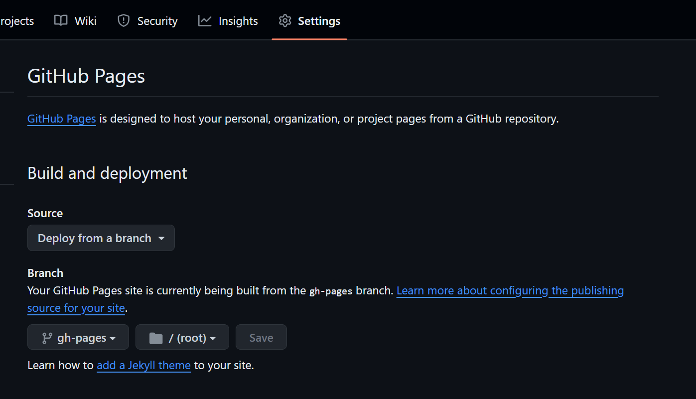

# mkdoc搭建Blog
在这里我参考了 [一份非常详细的教程in English](https://squidfunk.github.io/mkdocs-material/creating-your-site/) 不同于我原先的搭建方法（使用gh分支手动上传，非常的麻烦与不变）

一些其他的参考
- [mkdoc官方教程](https://www.mkdocs.org/user-guide/)
- [咸鱼暄](https://xuan-insr.github.io/%E6%9D%82%E9%A1%B9/%E5%8D%9A%E5%AE%A2%E6%90%AD%E5%BB%BA%E8%AE%B0%E5%BD%95/#%E5%85%A5%E9%97%A8%E6%95%99%E7%A8%8B)
- [ZLDF](https://zhengliangduanfang.github.io/hmpg_mkdocs/%E6%9D%82%E9%A1%B9/building/)
- [98一位大佬](https://7kevin24.github.io/Tech-guide/Mkdocs%20and%20Material%20theme/)

但是我觉得写的最好的还得是上面的In English写的

这里使用了**Github Actions**
在文件根目录添加
> .github/workflows/ci.yml

```
name: ci 
on:
  push:
    branches:
      - master 
      - main
permissions:
  contents: write
jobs:
  deploy:
    runs-on: ubuntu-latest
    steps:
      - uses: actions/checkout@v4
      - name: Configure Git Credentials
        run: |
          git config user.name github-actions[bot]
          git config user.email 41898282+github-actions[bot]@users.noreply.github.com
      - uses: actions/setup-python@v5
        with:
          python-version: 3.x
      - run: echo "cache_id=$(date --utc '+%V')" >> $GITHUB_ENV 
      - uses: actions/cache@v4
        with:
          key: mkdocs-material-${{ env.cache_id }}
          path: .cache
          restore-keys: |
            mkdocs-material-
      - run: pip install mkdocs-material 
      - run: mkdocs gh-deploy --force
```

这段代码 同时在项目仓库的设置中设置


这样每次在master分支下更新内容，就会自动更新部署的界面

## CSS文件理解
**CSS** 指层叠样式表 (Cascading Style Sheets)，就是对于HTML语言的渲染，这里有一个[CSS渲染HTML实例](https://www.runoob.com/try/demo_source/demo_default.htm)

