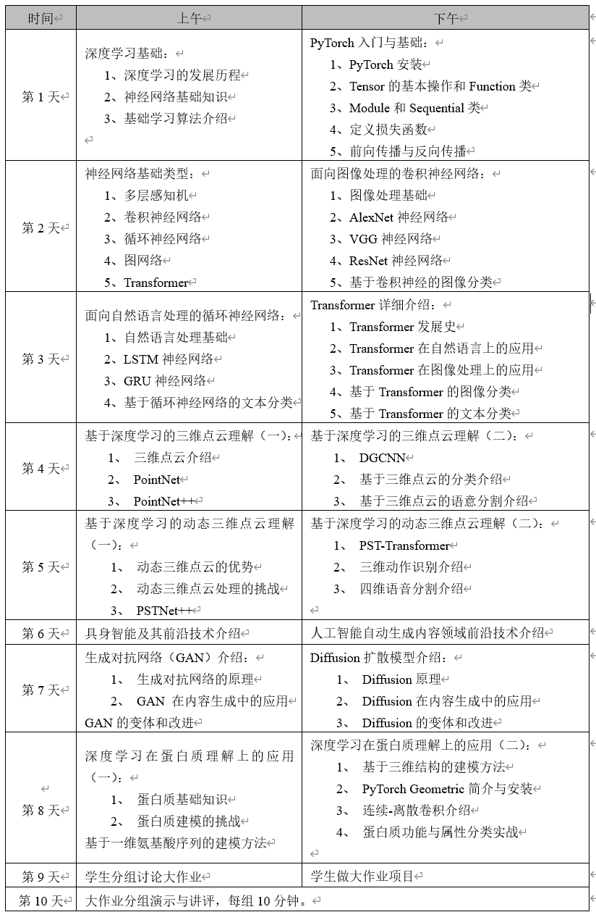

??? info "大作业要求 和 课程安排"
    实验题目：基于NumPy实现MNIST 数字图像分类

    实验目的：理解和实践深度学习基本概念，如神经网络、梯度下降、链式法则、分类、训练与测试。掌握处理图像和数学运算的技能。

    实验要求：
    1.	数据处理：使用python及其相关工具包库加载MNIST数据集。该数据集通常包含60000个训练图像和10000个测试图像，每个图像表示一个手写数字（0-9）。

    2.	模型设计：设计一个深度学习模型来进行数字分类。分别实现卷积神经网络或Transformer作为神经网络模型；使用numpy来实现前向传播和后向传播算法，不能采用PyTorch等深度学习框架。

    3.	训练算法：使用随机梯度下降（SGD）或其他优化算法来训练模型；实现损失函数，如交叉熵损失，来评估模型性能。

    4.	模型评估：在测试数据集上评估模型的准确性；分析模型在不同数字上的表现，识别可能的改进空间。

    5.	代码和报告撰写：总结实验结果，包括模型的准确率、网络层数的影响、不同激活函数的影响、训练策略的影响、遇到的问题以及解决方案。
    
    注意：识别准确率不作为评分标准。

    [深度学习前沿技术与应用-大作业](深度学习前沿技术与应用-大作业.pdf)

    

[This is the repository of the course project implement of a summer course called " Deep Learning" taught by Hehe Fan in ZJU.](https://github.com/Gaicie/ZJU_summer_dpl_23_2)
## Project
[Pytorch100例-第1天：实现mnist手写数字识别第1天](https://www.heywhale.com/mw/project/6496efc3ae1f61137ad53e1a)

[MNIST数据集简介](https://blog.csdn.net/tony_vip/article/details/118735261)搭配这个[数据的读取](https://blog.csdn.net/u013597931/article/details/80099243)效果更好

[深度学习——优化器算法Optimizer详解](https://www.cnblogs.com/guoyaohua/p/8542554.html)
## PyTorch设置
[深入浅出PyTorch](https://datawhalechina.github.io/thorough-pytorch/index.html)，一份非常好的教程

[清华大学PyPI 镜像使用帮助](https://mirrors.tuna.tsinghua.edu.cn/help/pypi/)，使用`pip config set global.index-url https://pypi.tuna.tsinghua.edu.cn/simple`来设置默认pip的源

## 人工智能与深度学习
