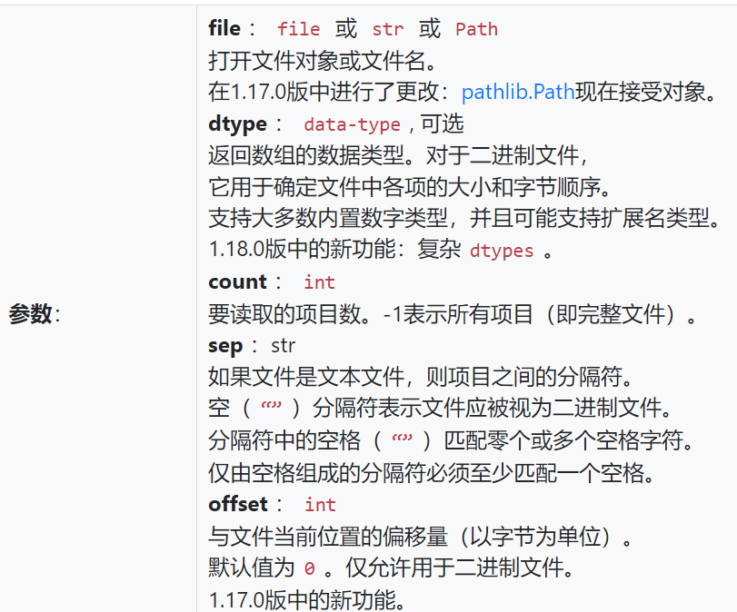

## 注释规范
良好的代码风格是必须要养成的，其实从数据库大程就应该做起了
[Python类和方法注释规范](https://blog.csdn.net/lly1122334/article/details/80733908)，这这里我觉得[Google](https://www.sphinx-doc.org/en/master/usage/extensions/example_google.html)的规范还是不错的

!!! note
    ```python
    def function_with_types_in_docstring(param1, param2):
    """Example function with types documented in the docstring.

    :pep:`484` type annotations are supported. If attribute, parameter, and
    return types are annotated according to `PEP 484`_, they do not need to be
    included in the docstring:

    Args:
        param1 (int): The first parameter.
        param2 (str): The second parameter.

    Returns:
        bool: The return value. True for success, False otherwise.
    """
    ```

## Class 相关

### __call__方法
!!! example
    ```python
    class Adder:
        def __init__(self, value):
            self.value = value

        def __call__(self, x):
            return self.value + x

    # 创建一个Adder实例，初始化value为10
    adder = Adder(10)

    # 直接调用实例，这会触发__call__方法
    result = adder(5)  # 等同于 adder.__call__(5)

    print(result)  # 输出 15
    ```

## os 库相关
### os.path.join函数
!!! example
    ```python
    import os

    # 合并目录和文件名
    path = os.path.join("my_dir", "my_file.txt")
    print(path)

    # 在Windows上输出: my_dir\my_file.txt
    # 在Unix/Linux上输出: my_dir/my_file.txt
    ```
自动处理不同操作系统中的路径分隔符差异，避免了手动拼接路径字符串时可能出现的错误。

## struct 库相关
[struct实际用法教学](https://www.liaoxuefeng.com/wiki/1016959663602400/1017685387246080)，搭配[python字符格式Format Characters](https://docs.python.org/3/library/struct.html#format-characters)来使用struct对齐

## Numpy 库相关
### numpy.fromfile(file, dtype=None, count=-1, sep='', offset=0)

返回值为一个list

