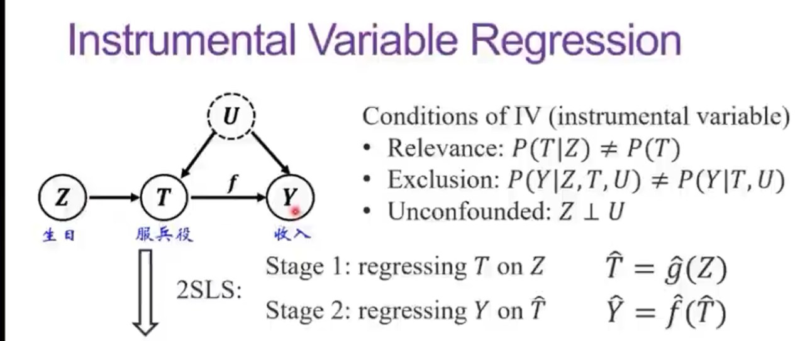

# 可信机器学习及应用
[【可信机器学习及应用】况琨：基于工具变量的因果推断和因果可泛化学习](https://www.bilibili.com/video/BV1ZF411Q7pE/?spm_id_from=333.1007.top_right_bar_window_history.content.click&vd_source=65c7b04cdd9f63be66a087d3a14b971e)

## 因果简介
写商品推荐算法，如何决策？同时测试1000个用户，辛普森悖论

定义：其他条件不变，改变T，导致Y改变

随机对照实验：特征分布相同 改变原因变量

**缺点**：耗钱，耗时间，很多时间不可行
!!! example
    不可行：吸烟对身体的影响，不能抽取人吸一个月烟

    反事实：如果吸烟了，就观察不到不吸烟的状态

    伪实验：观察到的数据不是随机的（不是随机对照实验）（特效药5k一片，吃药和不吃药财富不同）

**因果推断核心**：平衡混淆变量(除了原因以外的变量)的分布，保证其一致性

## 方法
做`matching`，只能低维度，不能高维度

倾向值：评估吃药概率，做`matching`，找吃药概率相同的 （主要解决二值问题 吃药还是不吃而不是吃多少片）

表征学习：投影到低维度，做平衡（哪些平衡，哪些不平衡）

**三大挑战**
- 找到混淆变量，不是所有的变量都需要控制
- 不是所有的混淆变量都观察到了
- 可能是多值，多维度

## 工具变量因果推断
服兵役是否影响收入？ 观察因果关联

生日作为工具变量

Z和T相关，Z和U独立，Z可以影响Y，但是只能通过T影响Y

两阶段回归，但是受限于线性假设，需要找到工具变量

非线性一些方法：DeepIV，KernelIV